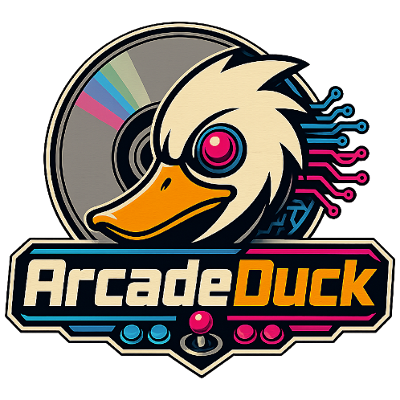

<p align="center">
  <a href="https://stilljc.github.io/ArcadeDuck-Site/">
    
  </a>
</p>

<h1 align="center">ArcadeDuck</h1>

<p align="center">
  An arcade-focused emulator for hardware derived from the original PlayStation architecture.
  <br>
  Built on the final GPL-era DuckStation codebase and focused on PS1-derived arcade hardware.
</p>

<p align="center">
  <a href="https://github.com/StillJC/ArcadeDuck/releases">
    
  </a>
  <a href="https://github.com/StillJC/ArcadeDuck/releases/tag/dev">
    
  </a>
  <a href="https://github.com/StillJC/ArcadeDuck/actions/workflows/release-main.yml">
    
  </a>
  <a href="https://github.com/StillJC/ArcadeDuck/actions/workflows/release-dev.yml">
    
  </a>
  <a href="https://discord.gg/e3ADpmY54f">
    
  </a>
</p>

ArcadeDuck started as an attempt to improve *The Simpsons Bowling* on Windows. That was apparently not enough trouble, so it grew into a broader project for PlayStation-derived arcade hardware and all the extra machinery arcade manufacturers bolted onto it.

ArcadeDuck is not intended to replace DuckStation as a retail PlayStation emulator. It is focused on arcade systems built around related PlayStation hardware.

## Get Started

> Please refer to [our website](https://stilljc.github.io/ArcadeDuck-Site/) for setup, supported hardware, compatibility, and documentation.

## Building from Source

ArcadeDuck currently supports building on **Windows x64**.

### Prerequisites

- Git
- Visual Studio 2022 with the **Desktop development with C++** workload and a Windows SDK
- The ArcadeDuck Windows x64 dependency bundle from the project releases
- LLVM/Clang if you want to use one of the Clang-based build configurations

### 1. Clone the repository

```powershell
git clone https://github.com/StillJC/ArcadeDuck.git
cd ArcadeDuck
```

For development work, check out the `dev` branch unless you specifically need an experimental hardware branch.

```powershell
git switch dev
```

### 2. Install the prebuilt Windows dependencies

Download the current files matching these names from the ArcadeDuck release assets:

- `ArcadeDuck-Windows-x64-Dependencies-*.zip`
- `ArcadeDuck-Windows-x64-Dependency-Sources-*.zip`
- `SHA256SUMS.txt`

The **Dependencies** ZIP is the package required to build ArcadeDuck. The **Dependency-Sources** ZIP contains the corresponding third-party source archives and notices and should be retained with the published binary dependency package.

Verify the downloaded dependency ZIP against `SHA256SUMS.txt`, then extract the **contents** of the dependency ZIP directly into the ArcadeDuck repository root.

After extraction, this file should exist:

```text
dep\msvc\deps-x64\bin\uic.exe
```

The package also installs its third-party metadata under:

```text
dep\msvc\dependency-metadata\
```

The dependency tree is intentionally not stored in Git.

### 3. Build ArcadeDuck

Open:

```text
ArcadeDuck.sln
```

Select an x64 configuration appropriate for your build and build the solution in Visual Studio.

The prebuilt dependency package has been validated from a clean ArcadeDuck worktree using the Visual Studio/MSBuild build path.

### Rebuilding the third-party dependencies

The prebuilt dependency package is the recommended route for contributors. If you need to rebuild the Windows x64 dependency tree yourself, the repository contains:

```text
scripts\deps\build-dependencies-windows-x64.bat
```

That script defines the dependency versions, source locations, and hashes used by the project. Rebuilding the complete dependency set requires additional developer tools beyond a normal ArcadeDuck build.

### Porting ArcadeDuck to other platforms

Windows x64 is the only currently supported and validated ArcadeDuck build target, but contributions for additional platforms and frontends are welcome.

The Windows dependency ZIP is **Windows-specific** and should not be treated as a dependency solution for another platform. A new target should use an appropriate native or reproducible dependency workflow for that platform.

Examples of possible future contribution areas include:

- Linux
- macOS or other desktop operating systems
- Other architectures where the underlying codebase can reasonably be supported
- A libretro/RetroArch frontend or core integration

A RetroArch/libretro target is different from simply adding another operating system. It would require a libretro-facing frontend layer and decisions around configuration, content loading, input, audio/video presentation, arcade-specific peripherals, external outputs, and features that currently depend on the standalone ArcadeDuck frontend.

When adding a new platform or frontend:

- Keep platform-specific code isolated from the shared emulator and arcade-hardware code wherever practical.
- Avoid introducing new Windows-only assumptions into shared code.
- Keep dependency/toolchain setup reproducible and document it alongside the new target.
- Preserve existing arcade-specific behavior rather than reducing the port to generic PlayStation emulation.
- Coordinate large ports through a GitHub issue or pull request before restructuring shared subsystems.

### Notes

- The packaged dependency tree is intended for the Visual Studio/MSBuild workflow.
- Some generated Qt CMake metadata can contain paths from the machine on which Qt was originally built, so the package should not currently be treated as a portable standalone CMake SDK.
- Do not report build failures caused by a missing `dep\msvc\deps-x64` tree until the dependency package has been extracted into the repository.

## Community

Join the ArcadeDuck Discord: [https://discord.gg/e3ADpmY54f](https://discord.gg/e3ADpmY54f)

## Special Thanks to:

- The DuckStation developers and contributors
- Arcade1Up contributors whose *The Simpsons Bowling* work helped kick this whole thing off
- [t-dollaz](https://github.com/t-dollaz) for the intermediate *The Simpsons Bowling* / Baby Phoenix work
- The MAME developers for the hardware research, documentation, and device implementations that provide essential reference material
- Everyone testing games, reporting bugs, digging through old arcade hardware, and helping us figure out what arcade engineers were doing in the 1990s

## License

ArcadeDuck is distributed under the GNU General Public License. See [LICENSE](LICENSE) for details.
